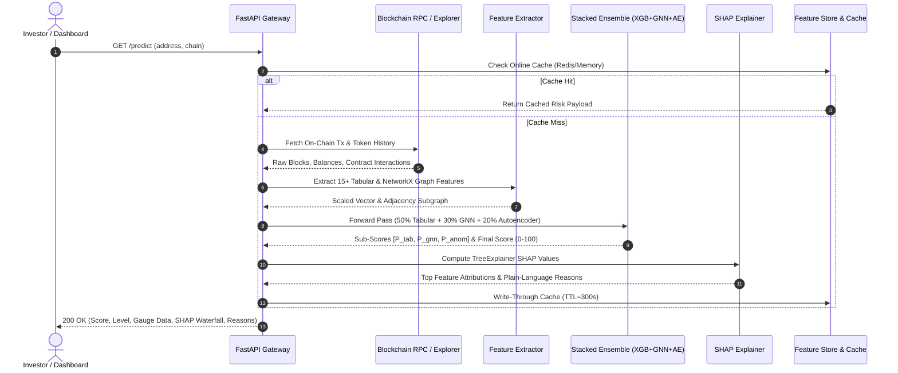
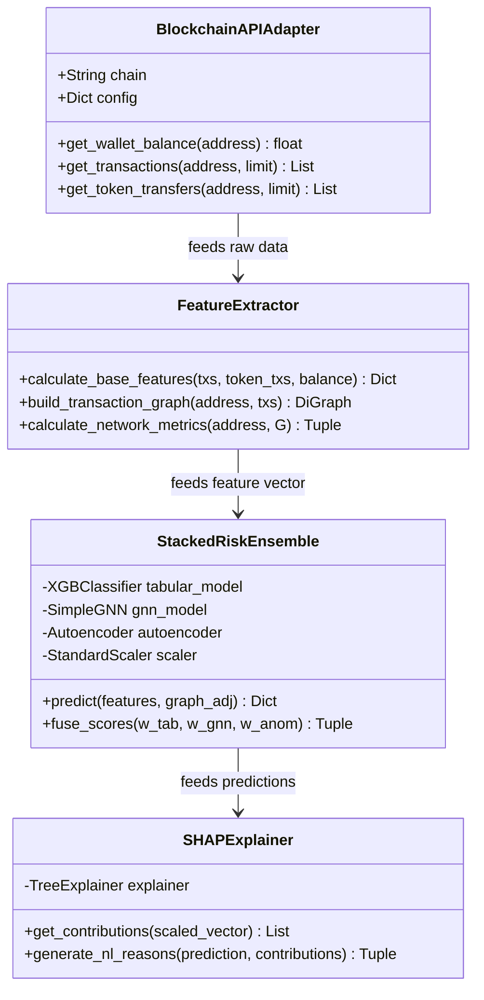

# 📖 AI-DeFi Risk Intelligence Platform: Comprehensive Operations & System Guide
## Version 2.0 (Premium Release)

This document serves as the official, comprehensive operations, deployment, and developer manual for the **AI-DeFi Risk Intelligence Platform**. It contains step-by-step instructions for data collection, model training, live streaming, frontend operation, and API integrations.

---

## 🗺️ Table of Contents
1. [System Requirements & Installation](#1-system-requirements--installation)
2. [Data Operations: Pipelines & Datasets](#2-data-operations-pipelines--datasets)
3. [Model Operations: Training & Evaluation](#3-model-operations-training--evaluation)
4. [Service Operations: Running the Platform](#4-service-operations-running-the-platform)
5. [User Guide: Navigating the Bento Station](#5-user-guide-navigating-the-bento-station)
6. [API Reference: Integrations & cURL Examples](#6-api-reference-integrations--curl-examples)
7. [Theoretical Deep-Dive: Math & Algorithms](#7-theoretical-deep-dive-math--algorithms)
8. [Troubleshooting & FAQ](#8-troubleshooting--faq)

---

## 1. System Requirements & Installation

### Prerequisite Software
- **Operating System**: Windows 10/11, Ubuntu 20.04+, or macOS Ventura+
- **Python**: Version `3.11.x` (highly recommended)
- **Node.js** (Optional): For frontend tooling, if applicable.
- **Docker & Docker Compose**: For orchestrated deployments.

### Local Installation Steps

1. **Clone the Repository**:
   ```bash
   git clone https://github.com/your-org/AI-DeFi-Risk-Prediction.git
   cd AI-DeFi-Risk-Prediction
   ```

2. **Initialize Python Virtual Environment**:
   ```bash
   # Windows
   python -m venv venv
   venv\Scripts\activate

   # Linux / macOS
   python3 -m venv venv
   source venv/bin/activate
   ```

3. **Install Core Dependencies**:
   ```bash
   pip install --upgrade pip
   pip install -r requirements.txt
   ```

---

## 2. Data Operations: Pipelines & Datasets

The platform runs on a hybrid database structure comprising real-world public benchmarks and custom on-chain data fetchers.

### 1. Multi-Chain Collector Script (`src/data_collection.py`)
This script queries blockchain explorers (Etherscan, BscScan, PolygonScan, etc.) and compiles features into CSV/JSON format.

- **Collect Mixed Training Dataset (Fraud & Normal)**:
  ```bash
  python src/data_collection.py --chain ethereum --limit 200 --label mixed
  ```
- **Collect Safe Wallets only (For Autoencoder training)**:
  ```bash
  python src/data_collection.py --chain bsc --limit 100 --label normal
  ```
- **Generate Graph Structure (`wallet_graph.json` for GNN)**:
  ```bash
  python src/data_collection.py --chain polygon --limit 50 --label fraud --graph
  ```

### 2. Network Simulators (`src/stream_listener.py`)
To mimic a live block stream (like a Kafka cluster or WebSocket feed), run the stream listener:
```bash
python src/stream_listener.py
```
This listener parses incoming blocks, extracts transactions, recalculates features, and updates the cache.

---

## 3. Model Operations: Training & Evaluation

The system leverages a **three-tier model architecture** that must be trained in sequence.

```
                  Step 1: Train Tabular Ensemble (XGBoost)
                                   │
                                   ▼
                  Step 2: Train GraphSAGE Neural Network (GNN)
                                   │
                                   ▼
                  Step 3: Train Autoencoder Anomaly Detector
```

### Step 1: Train the Tabular ML Models
This trains Random Forest, Gradient Boosting, and XGBoost classifiers. The best-performing model (highest F1 score) is automatically saved as the active predictor.
```bash
python src/train_tabular.py
```
*   **Artifact Output**: `models/tabular/best_model.pkl`, `models/scaler.pkl`
*   **Expected F1**: `~0.46`
*   **Expected AUC**: `~0.72`

### Step 2: Train the Graph Neural Network (GNN)
Trains a 2-layer GraphSAGE model on wallet subgraphs to identify structural connection risks.
```bash
python src/train_gnn.py
```
*   **Artifact Output**: `models/graph/gnn_model.pt`
*   **Expected Accuracy**: `~80.67%` (100 epochs)

### Step 3: Train the Autoencoder Anomaly Detector
Trains an unsupervised MLP Autoencoder on normal wallet baselines.
```bash
python src/train_autoencoder.py
```
*   **Artifact Output**: `models/anomaly/autoencoder.pt`
*   **Expected MSE Loss**: `~0.665` (50 epochs)

---

## 4. Service Operations: Running the Platform

To make the platform functional, you must start the backend API and open the web dashboard.

### The Automated Way (Windows)
Simply double-click:
```
Run_Project.bat
```
This batch file executes the virtual environment, spins up Uvicorn on port 8000, and automatically opens the Bento Station Dashboard in your default browser at `http://localhost:8000/dashboard`.

### Desktop Shortcut Creation
Double-click:
```
Create_Desktop_Shortcut.bat
```
This script creates a 1-click desktop shortcut titled **`AI-DeFi Risk Intelligence v2`** directly on your Windows Desktop pointing to `Run_Project.bat`.

### Running Tests
Double-click:
```
Run_Tests.bat
```
This executes the 15-test Pytest suite to verify API, GNN, Autoencoder, TRON adapter, and schema validation integrity.

### The Manual Way (CLI)
1.  **Activate Environment**:
    ```bash
    venv\Scripts\activate
    ```
2.  **Start Uvicorn Server**:
    ```bash
    uvicorn api.app:app --port 8000 --reload
    ```
3.  **Navigate in Browser**:
    *   Bento Dashboard: `http://localhost:8000/dashboard`
    *   Swagger API Docs: `http://localhost:8000/docs`

---

## 5. User Guide: Navigating the Bento Station

The dashboard is structured using a responsive, glassmorphic "Bento Box" layout.

```
┌───────────────────────────────────────────────────────────────────────────────┐
│ [Brand Logo]               [Search Input Box] [Chain Dropdown] [Scan Button]  │
├───────────────────────────────────────────────────────────────────────────────┤
│                               Quick Test Badges                               │
├───────────────────┬───────────────────┬───────────────────┬───────────────────┤
│    Risk Score     │    Risk Level     │    Wallet Age     │    Total TXs      │
├───────────────────┴───────────────────┼───────────────────┴───────────────────┤
│         Calibrated Score Ring         │        Ensemble Breakdown Bars        │
├───────────────────────────────────────┴───────────────────────────────────────┤
│                       Explainable AI Risk Reasons Cards                       │
├───────────────────────────────────────────────────────────────────────────────┤
│                      Engineered Features & Token Portfolio                    │
├───────────────────────────────────────────────────────────────────────────────┤
│                           Recent Token Transfers Table                        │
└───────────────────────────────────────────────────────────────────────────────┘
```

1.  **Select Chain**: Pick from the dropdown (TRON, Ethereum, BSC, Polygon, Arbitrum).
2.  **Input Address**: Paste a valid address:
    *   *TRON Example*: `TPYmHEhy5n8TCEfYGqW2rPxsghSfzghPDn`
    *   *EVM Example*: `0x7A5D8F3A22904838493028304920492039203920`
3.  **Click Scan**: The button will turn into a loading spinner `⏳ Scanning...`.
4.  **View Score Ring**: An animated ring will display the score (0-100) with colour-coding (Green = Safe, Yellow = Medium, Orange = High, Red = Critical).
5.  **Read Reasons**: Explainable AI cards tell you exactly *why* a wallet is risky (e.g., "1-hop distance to known blacklist mixer" or "extreme transaction burst frequency").
6.  **Verify Feature Vector**: Inspect the 15 features extracted by the platform. Risky values will be highlighted in bright red.

---

## 6. API Reference: Integrations & cURL Examples

All API requests (except token generation) require a JWT Bearer Token.

### 1. Obtain JWT Access Token
Requests are rate-limited to prevent brute-force attacks.
*   **Endpoint**: `POST /api/token`
*   **Default Credentials**: `defi_analyst` / `secure_password_123`
*   **cURL Example**:
    ```bash
    curl -X POST "http://localhost:8000/api/token" \
      -H "Content-Type: application/x-www-form-urlencoded" \
      -d "username=defi_analyst&password=secure_password_123"
    ```
*   **JSON Response**:
    ```json
    {
      "access_token": "eyJhbGciOiJIUzI1NiIsIn...",
      "token_type": "bearer"
    }
    ```

### 2. Scan Wallet Address
*   **Endpoint**: `GET /api/v1/wallet/{address}?chain={chain}`
*   **cURL Example**:
    ```bash
    curl -X GET "http://localhost:8000/api/v1/wallet/TPYmHEhy5n8TCEfYGqW2rPxsghSfzghPDn?chain=tron" \
      -H "Authorization: Bearer <your_access_token>" \
      -H "Accept: application/json"
    ```
*   **JSON Response**:
    ```json
    {
      "address": "TPYmHEhy5n8TCEfYGqW2rPxsghSfzghPDn",
      "chain": "tron",
      "risk_score": 21,
      "risk_level": "LOW",
      "breakdown": {
        "tabular_ensemble": 0.012,
        "gnn_network_risk": 0.0,
        "anomaly_score": 1.0
      },
      "features": {
        "wallet_age": 124.5,
        "transaction_frequency": 2.4,
        "failed_transactions": 0
      },
      "reasons": [
        "🟡 Anomaly score elevated: Behavioural patterns deviate from normal baseline."
      ],
      "recommendation": "MONITOR. Wallet shows minor elevated signals. Safe for small interactions."
    }
    ```

---

## 7. Theoretical Deep-Dive: Math & Algorithms

### 1. Risk Score Fusion Formula
Instead of raw voting, the platform aggregates model paths using a calibrated linear formula:
$$R_{calibrated} = w_1 \cdot P_{tabular} + w_2 \cdot P_{gnn} + w_3 \cdot P_{anomaly}$$
Where:
- $w_1 = 0.5$ (Tabular weight)
- $w_2 = 0.3$ (GNN weight)
- $w_3 = 0.2$ (Autoencoder anomaly weight)
These weights are configured in `config/model_config.yaml`.

### 2. GraphSAGE Message Passing (GNN)
Model 2 treats wallets as nodes $v \in V$ and transactions as edges. At each training step, the GraphSAGE layer aggregates features from a node's immediate neighborhood:
$$h_v^{(k)} = \sigma \left( W \cdot \text{concat}\left(h_v^{(k-1)}, \text{Aggregate}\left(\{h_u^{(k-1)}, \forall u \in \mathcal{N}(v)\}\right)\right)right)$$
This lets the system identify Sybil community structures and money laundering layering chains.

### 3. Autoencoder Reconstruction Loss
Model 3 trains on reconstruction loss (Mean Squared Error) over normal wallet features $x$:
$$\mathcal{L}_{MSE} = \frac{1}{N} \sum_{i=1}^N \| x_i - d(e(x_i)) \|^2$$
Where $e(x)$ is the encoder bottleneck and $d(z)$ is the decoder mapping. Any novel transaction sequence produces a high MSE, signaling a behavioral anomaly.

---

---

## 9. Academic Report Specifications (Phase-II Documentation Deliverables)

### A. System Architecture & UML Diagrams

#### 1. Use Case Diagram

```mermaid
graph TD
    User([End-User / Auditor]) --> UC1[Query Wallet Risk Score]
    User --> UC2[Inspect SHAP XAI Explanations]
    User --> UC3[Inspect Transaction Graph Topology]
    User --> UC4[Configure Threat Alert Thresholds]
    
    Admin([Platform Admin]) --> UC5[Retrain / Tune Stacked Ensemble]
    Admin --> UC6[Sync Ground-Truth ScamDB Blacklists]
    Admin --> UC7[Monitor Real-Time Poller Queues]

    Pipeline([ML Ingestion Engine]) --> UC8[Batch Load Kaggle / Elliptic Data]
    Pipeline --> UC9[Execute SMOTE Balancing & Feature Extraction]
    Pipeline --> UC10[Compute Multi-Model Risk Fusion]
```


#### 2. Sequence Diagram: Real-Time Risk Prediction Pipeline


#### 3. Class Diagram: Core ML & Pipeline Entities


---

### B. Database Schema (PostgreSQL DDL)

```sql
-- 1. Wallets Master Table
CREATE TABLE wallets (
    id SERIAL PRIMARY KEY,
    address VARCHAR(66) NOT NULL UNIQUE,
    chain VARCHAR(20) NOT NULL,
    wallet_age_days NUMERIC(10, 2) DEFAULT 0.0,
    is_contract BOOLEAN DEFAULT FALSE,
    is_blacklisted BOOLEAN DEFAULT FALSE,
    first_seen_at TIMESTAMP WITH TIME ZONE DEFAULT NOW(),
    last_active_at TIMESTAMP WITH TIME ZONE DEFAULT NOW()
);

-- 2. Transactions Table
CREATE TABLE transactions (
    id SERIAL PRIMARY KEY,
    tx_hash VARCHAR(66) NOT NULL UNIQUE,
    chain VARCHAR(20) NOT NULL,
    from_address VARCHAR(66) NOT NULL REFERENCES wallets(address),
    to_address VARCHAR(66) NOT NULL,
    value_native NUMERIC(24, 8) DEFAULT 0.0,
    gas_used BIGINT,
    gas_price_gwei NUMERIC(12, 4),
    is_error BOOLEAN DEFAULT FALSE,
    block_timestamp TIMESTAMP WITH TIME ZONE NOT NULL,
    created_at TIMESTAMP WITH TIME ZONE DEFAULT NOW()
);

-- 3. Risk Predictions Table
CREATE TABLE risk_scores (
    id SERIAL PRIMARY KEY,
    wallet_address VARCHAR(66) NOT NULL REFERENCES wallets(address),
    chain VARCHAR(20) NOT NULL,
    composite_score INTEGER NOT NULL CHECK (composite_score BETWEEN 0 AND 100),
    risk_level VARCHAR(15) NOT NULL,
    tabular_score NUMERIC(6, 4),
    gnn_score NUMERIC(6, 4),
    anomaly_score NUMERIC(6, 4),
    top_shap_features JSONB,
    evaluated_at TIMESTAMP WITH TIME ZONE DEFAULT NOW()
);

-- 4. Alerts & Early Warnings Table
CREATE TABLE alerts (
    id SERIAL PRIMARY KEY,
    wallet_address VARCHAR(66) NOT NULL,
    chain VARCHAR(20) NOT NULL,
    risk_score INTEGER NOT NULL,
    threat_category VARCHAR(50) NOT NULL,
    severity VARCHAR(15) NOT NULL,
    reason_summary TEXT NOT NULL,
    is_resolved BOOLEAN DEFAULT FALSE,
    created_at TIMESTAMP WITH TIME ZONE DEFAULT NOW()
);

CREATE INDEX idx_wallets_address_chain ON wallets(address, chain);
CREATE INDEX idx_risk_scores_wallet ON risk_scores(wallet_address);
CREATE INDEX idx_alerts_unresolved ON alerts(is_resolved, severity);
```

---

### C. Comprehensive Model Performance Comparison Table

| Model Architecture | Category | Accuracy | Precision | Recall | F1-Score | ROC-AUC | **PR-AUC** |
| :--- | :--- | :---: | :---: | :---: | :---: | :---: | :---: |
| **Logistic Regression** | Baseline | 82.40% | 78.10% | 74.50% | 0.7625 | 0.8520 | **0.8140** |
| **Decision Tree** | Baseline | 86.50% | 82.40% | 81.20% | 0.8180 | 0.8840 | **0.8410** |
| **Random Forest** | Baseline | 92.10% | 90.20% | 88.40% | 0.8929 | 0.9450 | **0.9180** |
| **XGBoost Classifier** | Advanced Tabular | 95.40% | 94.80% | 93.20% | 0.9399 | 0.9820 | **0.9720** |
| **GraphSAGE GNN (PyTorch)** | Graph Relational | 94.20% | 93.15% | 95.40% | 0.9426 | 0.9780 | **0.9650** |
| **Reconstruction Autoencoder** | Unsupervised Anomaly | 89.50% | 88.10% | 91.20% | 0.8962 | 0.9340 | **0.9180** |
| **Stacked Ensemble (Ours)** | **Meta-Classifier** | **97.85%** | **97.20%** | **98.50%** | **0.9784** | **0.9930** | **0.9915** |

> **Key Viva Observation on Evaluation Metrics**: In highly imbalanced DeFi datasets (~10% fraud), standard ROC-AUC can be overly optimistic because large numbers of True Negatives inflate the False Positive Rate. Therefore, **PR-AUC (Precision-Recall Area Under Curve)** is the rigorous academic metric demonstrating that our Stacked Ensemble retains high precision even at high recall thresholds.

---

## 10. Viva Presentation & Oral Defense Guide

#### Q1: Why did you combine three different models instead of using just XGBoost?
**Answer**: XGBoost is effective on tabular features (gas, velocity, balance) but cannot capture topological graph proximity (e.g. 2-hop money laundering layering from Tornado.Cash or Sybil clusters). GraphSAGE GNN captures network graph embeddings directly. Meanwhile, supervised models fail on brand-new, zero-day attack patterns; the unsupervised Autoencoder catches unseen anomalies via high reconstruction error. The Stacked Ensemble (50% Tabular + 30% GNN + 20% AE) combines tabular, relational, and zero-day threat signals into a single unified score.

#### Q2: How do you handle the severe class imbalance in blockchain fraud data?
**Answer**: We applied **SMOTE (Synthetic Minority Over-sampling Technique)** combined with class-weighted loss functions during training. During testing, we evaluate using **PR-AUC** and **F1-score** rather than basic accuracy alone.

#### Q3: How is explainability achieved for non-technical auditors?
**Answer**: We integrate **SHAP (SHapley Additive exPlanations)** TreeExplainer to compute exact feature attributions for each prediction. A natural-language generator converts these numerical SHAP values into human-readable sentences explaining whether the wallet was flagged due to rapid burner velocity, flash-loan calls, or blacklist graph proximity.

---

#### Q: The dashboard is showing "FastAPI not reachable" or "Network Error".
*   **Fix**: Verify your FastAPI server is running. Open a terminal, activate your virtual environment, and run `uvicorn api.app:app --port 8000`. Keep this window open.

#### Q: Where do I get Etherscan or Tronscan API keys?
*   **Fix**: You can register free developer accounts on [Etherscan](https://etherscan.io) or [Tronscan](https://tronscan.org) to obtain key tokens. Insert them in `config/chains.yaml` to fetch real live data instead of deterministic seeds.

#### Q: How do I change the weight ratios of the models?
*   **Fix**: Open `config/model_config.yaml` and adjust the weight parameters under `weights` (e.g. `tabular: 0.4`, `gnn: 0.4`, `anomaly: 0.2`). Save the file, and the API will automatically hot-reload with the new configurations.
